<!-- Header & Title -->
<div align="center">
  
  # Hi there, I'm MaizeShark! 

  ### 16 y/o Student • Linux Enthusiast • Tinkerer 🇩🇪

  <a href="https://github.com/MaizeShark">
    
  </a>
  <a href="https://maizeshark.github.io">
    
  </a>
  <br><br>

  <!-- GitHub Stats (Centered & Borderless for clean look) -->
  
  

</div>

---

### 👨‍💻 About Me

Curious tinkerer, passionate developer, and lifelong learner. I enjoy exploring **Linux, Open Source, Reverse Engineering, 3D printing**, and **PCB design**.

- 🌱 **Learning:** Advanced PCB design (KiCad) & Rust
- 📫 **Contact:** [niclaseisenhut@gmail.com](mailto:niclaseisenhut@gmail.com) or Discord (``niclas_op``)

---

### 🛠 Tech Stack & Hardware

<div align="center">

  <!-- Hardware Badges -->
  
  
  
  <br><br>

  <!-- Tech Stack Cards -->
  

</div>

<br>

<!-- Collapsible Activity Stats to save space -->
<details>
<summary><b>📊 Click to view detailed Commit Activity</b></summary>
<br>

<!--START_SECTION:waka-->


**🐱 My GitHub Data** 

> 📦 542.3 kB Used in GitHub's Storage 
 > 
> 🏆 130 Contributions in the Year 2026
 > 
> 💼 Opted to Hire
 > 
> 📜 44 Public Repositories 
 > 
> 🔑 26 Private Repositories 
 > 
**I'm a Night 🦉** 

```text
🌞 Morning                17 commits          █░░░░░░░░░░░░░░░░░░░░░░░░   03.73 % 
🌆 Daytime                185 commits         ██████████░░░░░░░░░░░░░░░   40.57 % 
🌃 Evening                214 commits         ████████████░░░░░░░░░░░░░   46.93 % 
🌙 Night                  40 commits          ██░░░░░░░░░░░░░░░░░░░░░░░   08.77 % 
```
📅 **I'm Most Productive on Wednesday** 

```text
Monday                   43 commits          ██░░░░░░░░░░░░░░░░░░░░░░░   09.43 % 
Tuesday                  40 commits          ██░░░░░░░░░░░░░░░░░░░░░░░   08.77 % 
Wednesday                108 commits         ██████░░░░░░░░░░░░░░░░░░░   23.68 % 
Thursday                 34 commits          ██░░░░░░░░░░░░░░░░░░░░░░░   07.46 % 
Friday                   56 commits          ███░░░░░░░░░░░░░░░░░░░░░░   12.28 % 
Saturday                 97 commits          █████░░░░░░░░░░░░░░░░░░░░   21.27 % 
Sunday                   78 commits          ████░░░░░░░░░░░░░░░░░░░░░   17.11 % 
```


📊 **This Week I Spent My Time On** 

```text
🕑︎ Time Zone: Europe/Berlin

🔥 Editors: 
Claude Code              1 hr 34 mins        ██████████████████████░░░   86.91 % 
VS Code                  9 mins              ██░░░░░░░░░░░░░░░░░░░░░░░   08.90 % 
CLion                    4 mins              █░░░░░░░░░░░░░░░░░░░░░░░░   03.75 % 
Unknown Editor           0 secs              ░░░░░░░░░░░░░░░░░░░░░░░░░   00.44 % 

🐱‍💻 Projects: 
linux                    50 mins             ████████████░░░░░░░░░░░░░   46.29 % 
JLCONE                   26 mins             ██████░░░░░░░░░░░░░░░░░░░   23.94 % 
github-readme-info       17 mins             ████░░░░░░░░░░░░░░░░░░░░░   15.94 % 
MaizeShark               7 mins              ██░░░░░░░░░░░░░░░░░░░░░░░   07.30 % 
hello_cargo              4 mins              █░░░░░░░░░░░░░░░░░░░░░░░░   04.19 % 
```


 Last Updated on 09/07/2026 02:44:21 UTC
<!--END_SECTION:waka-->
</details>

<br>

<div align="center">
  <picture>
    <source media="(prefers-color-scheme: dark)" srcset="https://raw.githubusercontent.com/MaizeShark/MaizeShark/output/github-contribution-grid-snake-dark.svg" />
    <source media="(prefers-color-scheme: light)" srcset="https://raw.githubusercontent.com/MaizeShark/MaizeShark/output/github-contribution-grid-snake.svg" />
    
  </picture>
  
  <br><br>
  
  > _"My code isn't buggy, it just has unexpected purr-sonality."_ 😼
</div>
