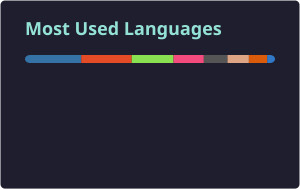

<!-- Header & Title -->
<div align="center">
  
  # Hi there, I'm MaizeShark! 

  ### 16 y/o Student • Linux Enthusiast • Tinkerer 🇩🇪

  <a href="https://github.com/MaizeShark">
    
  </a>
  <a href="https://maizeshark.github.io">
    
  </a>
  <br><br>

  <!-- GitHub Stats (Centered & Borderless for clean look) -->
  
  

</div>

---

### 👨‍💻 About Me

Curious tinkerer, passionate developer, and lifelong learner. I enjoy exploring **Linux, Open Source, Reverse Engineering, 3D printing**, and **PCB design**.

- 🌱 **Learning:** Advanced PCB design (KiCad) & Rust
- 📫 **Contact:** [niclaseisenhut@gmail.com](mailto:niclaseisenhut@gmail.com) or Discord (``niclas_op``)

---

### 🛠 Tech Stack & Hardware

<div align="center">

  <!-- Hardware Badges -->
  
  
  
  <br><br>

  <!-- Tech Stack Cards -->
  

</div>

<br>

<!-- Collapsible Activity Stats to save space -->
<details>
<summary><b>📊 Click to view detailed Commit Activity</b></summary>
<br>

<!--START_SECTION:waka-->


**🐱 My GitHub Data** 

> 📦 684.3 kB Used in GitHub's Storage 
 > 
> 🏆 189 Contributions in the Year 2026
 > 
> 💼 Opted to Hire
 > 
> 📜 47 Public Repositories 
 > 
> 🔑 28 Private Repositories 
 > 
**I'm a Night 🦉** 

```text
🌞 Morning                17 commits          █░░░░░░░░░░░░░░░░░░░░░░░░   03.28 % 
🌆 Daytime                209 commits         ██████████░░░░░░░░░░░░░░░   40.35 % 
🌃 Evening                244 commits         ████████████░░░░░░░░░░░░░   47.10 % 
🌙 Night                  48 commits          ██░░░░░░░░░░░░░░░░░░░░░░░   09.27 % 
```
📅 **I'm Most Productive on Saturday** 

```text
Monday                   49 commits          ██░░░░░░░░░░░░░░░░░░░░░░░   09.46 % 
Tuesday                  42 commits          ██░░░░░░░░░░░░░░░░░░░░░░░   08.11 % 
Wednesday                102 commits         █████░░░░░░░░░░░░░░░░░░░░   19.69 % 
Thursday                 38 commits          ██░░░░░░░░░░░░░░░░░░░░░░░   07.34 % 
Friday                   90 commits          ████░░░░░░░░░░░░░░░░░░░░░   17.37 % 
Saturday                 119 commits         ██████░░░░░░░░░░░░░░░░░░░   22.97 % 
Sunday                   78 commits          ████░░░░░░░░░░░░░░░░░░░░░   15.06 % 
```


📊 **This Week I Spent My Time On** 

```text
🕑︎ Time Zone: Europe/Berlin

🔥 Editors: 
Claude Code              18 hrs 14 mins      ███████████████░░░░░░░░░░   60.94 % 
VS Code                  7 hrs               ██████░░░░░░░░░░░░░░░░░░░   23.38 % 
Codex Vscode             4 hrs 41 mins       ████░░░░░░░░░░░░░░░░░░░░░   15.68 % 

🐱‍💻 Projects: 
TeslaMCU                 27 hrs 27 mins      ███████████████████████░░   91.69 % 
mcu2-desktop             48 mins             █░░░░░░░░░░░░░░░░░░░░░░░░   02.70 % 
MCU2-S                   37 mins             █░░░░░░░░░░░░░░░░░░░░░░░░   02.10 % 
tesla-hw25-re            34 mins             ░░░░░░░░░░░░░░░░░░░░░░░░░   01.91 % 
good-roatating-back-doesn7 mins              ░░░░░░░░░░░░░░░░░░░░░░░░░   00.43 % 
```

🤖 **AI Coding This Week** 

```text
⏱ AI Coding Time: 25 hrs 13 mins (84.24%)

✍️ 6,720 lines written by AI, 577 lines written by hand (92.09% AI-written)

🔤 10,664,498 Input Tokens, 1,776,516 Output Tokens

💵 $277.82 Estimated AI Cost This Week

🧠 56 AI Sessions, 912 AI Prompts

Opus                     4,368 lines         ████████████████░░░░░░░░░   64.03 % 
GPT                      2,150 lines         ████████░░░░░░░░░░░░░░░░░   31.52 % 
Github-Copilot           261 lines           █░░░░░░░░░░░░░░░░░░░░░░░░   03.83 % 
Sonnet                   31 lines            ░░░░░░░░░░░░░░░░░░░░░░░░░   00.45 % 
Codex-Vscode             12 lines            ░░░░░░░░░░░░░░░░░░░░░░░░░   00.18 % 

🔎 AI Coding Insights:
🤖 AI-Driven — 92.09% of written lines came from AI
📚 Verbose Prompter — average 5,760 characters per prompt
🔁 Iterative Prompter — average 16 prompts per session
🚀 High AI Trust — 9.43% of changed lines were hand-edited
```


 Last Updated on 01/10/2026 04:05:34 UTC
<!--END_SECTION:waka-->
</details>

<br>

<div align="center">
  <picture>
    <source media="(prefers-color-scheme: dark)" srcset="https://raw.githubusercontent.com/MaizeShark/MaizeShark/output/github-contribution-grid-snake-dark.svg" />
    <source media="(prefers-color-scheme: light)" srcset="https://raw.githubusercontent.com/MaizeShark/MaizeShark/output/github-contribution-grid-snake.svg" />
    
  </picture>
  
  <br><br>
  
  > _"My code isn't buggy, it just has unexpected purr-sonality."_ 😼

  PFP: [© Frank Schulenburg / CC BY-SA 4.0](https://de.wikipedia.org/wiki/Datei:Male_wild_turkey_(Meleagris_gallopavo)_strutting.jpg)
</div>
